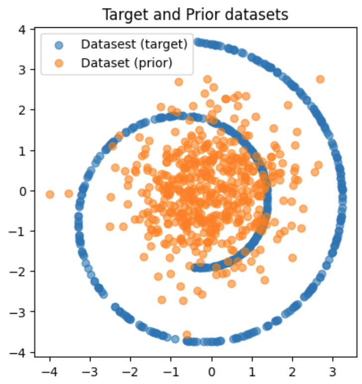
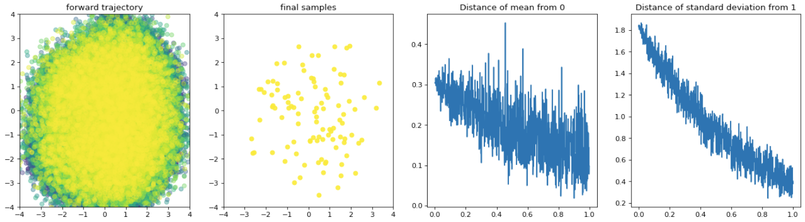
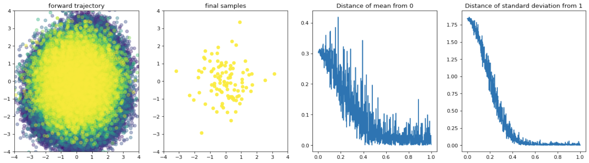
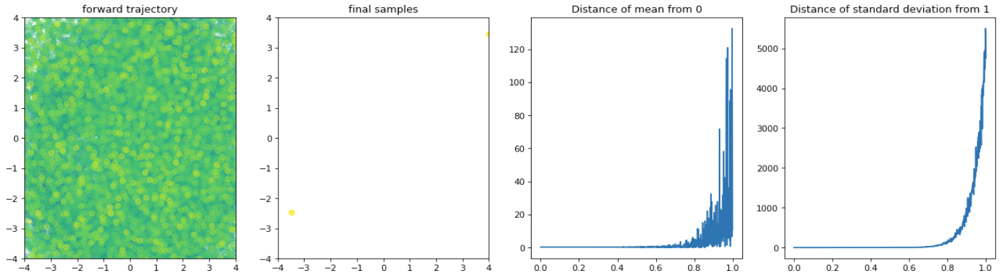
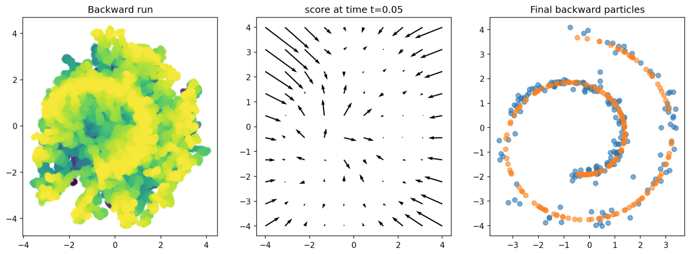
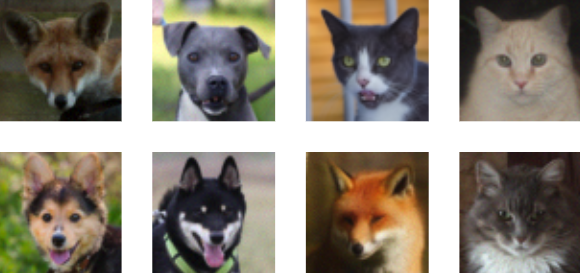
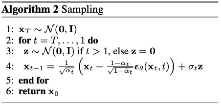
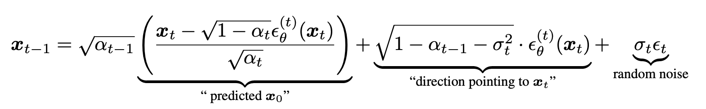
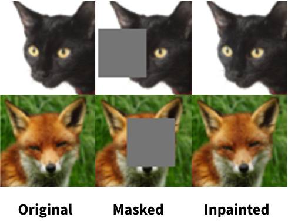
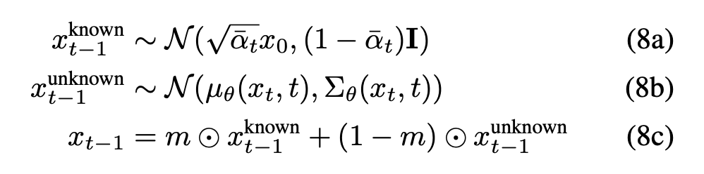

<div align=center>
  <h1>
    Introduction to Diffusion Models
  </h1>
  <div align=center>
    <div align=center>
      <b>Juil Koo &emsp; Nguyen Minh Hieu</b>
    </div>
    <div align=center>
      <p align=center>{63days, hieuristics} [at] kaist.ac.kr</p>
    </div>
  </div>
</div>

<div align=center>
   
</div>

<details>
<summary><b>Table of Content</b></summary>

- [Task 0](#task-0-introduction)
- [Task 1](#task-1-very-simple-sgm-pipeline-with-delicious-swiss-roll)
  - [Task 1.1](#11-forward-and-reverse-process) [(a)](#a-ou-process), [(b)](#b-vpsde--vesde)
  - [Task 1.2](#12-training)
  - [Task 1.3](#13-sampling)
  - [Task 1.4](#14-evaluation)
- [Task 2](#task-2-image-diffusion)
  - [Task 2.1](21-ddim)
  - [Task 2.2](22-classifier-free-guidance)
  - [Task 2.3](23-image-inpainting)

</details>

<details>
<summary><b>Task Checklist</b></summary>
  
</br>

**Task 1**
- [ ] 1.1 Define Forward SDE
- [ ] 1.1 Define Backward SDE
- [ ] 1.1 Define VPSDE
- [ ] 1.1 Define VESDE
- [ ] 1.2 Implement MLP Network 
- [ ] 1.2 Implement DSM Loss
- [ ] 1.2 Implement Training Loop
- [ ] 1.3 Implement Discretization
- [ ] 1.3 Implement Sampling Loop
- [ ] 1.4 Evaluate Implementation

**Task 2**
- [ ] 2.1 Implement DDIM Variance Scheduling
- [ ] 2.2 Implement CFG
- [ ] 2.3 Implement Image Inpainting
      
**Optional Tasks**
- [X] Add more additional task that you did here.
- [ ] Implement EMA Training 
- [ ] Implement ISM Loss
- [ ] Implement ODE Sampling
- [ ] Implement Schrodinger Bridge
- [ ] Implement MCG Inpainting

</details>


## Setup

Install the required package within the `requirements.txt`
```
pip install -r requirements.txt
```

## Code Structure
```
.
├── image_diffusion (Task 2)
│   ├── dataset.py                <--- Ready-to-use AFHQ dataset code
│   ├── train.py                  <--- DDPM training code
│   ├── sampling.py               <--- Image sampling code
│   ├── ddpm.py                   <--- DDPM high-level wrapper code
│   ├── module.py                 <--- Basic modules of a noise prediction network
│   ├── network.py                <--- Noise prediction network
│   ├── scheduler.py              <--- (TODO) Define variance schedulers
│   └── fid
│       ├── measure_fid.py        <--- script measuring FID score
│       └── afhq_inception.ckpt   <--- pre-trained classifier for FID
└── sde_todo        (Task 1)
    ├── HelloScore.ipynb          <--- Main code
    ├── dataset.py                <--- Define dataset (Swiss-roll, moon, gaussians, etc.)
    ├── eval.py                   <--- Evaluation code
    ├── loss.py                   <--- (TODO) Define Training Objective
    ├── network.py                <--- (TODO) Define Network Architecture
    ├── sampling.py               <--- (TODO) Define Discretization and Sampling
    ├── sde.py                    <--- (TODO) Define SDE Processes
    └── train.py                  <--- (TODO) Define Training Loop
```

## Tutorial Tips

Implementation of Diffusion Models is typically very simple once you understand the theory.
So, to learn the most from this tutorial, it's highly recommended to check out the details in the
related papers and understand the equations **BEFORE** you start the tutorial. You can check out
the resources in this order:
1. [[blog](https://min-hieu.github.io/blogs/blogs/brownian/)] Charlie's "Brownian Motion and SDE"
2. [[paper](https://arxiv.org/abs/2011.13456)] Score-Based Generative Modeling through Stochastic Differential Equations
3. [[blog](https://lilianweng.github.io/posts/2021-07-11-diffusion-models/)] Lilian Wang's "What is Diffusion Model?"
4. [[paper](https://arxiv.org/abs/2006.11239)] Denoising Diffusion Probabilistic Models
5. [[slide](./assets/summary_of_DDPM_and_DDIM.pdf)] Summary of DDPM and DDIM

## Task 0: Introduction
The first part of this tutorial will introduce diffusion models through the lens of stochastic differential equations (SDE). 
Prior to the [Yang Song et al. (2021)](https://arxiv.org/abs/2011.13456) paper, diffusion models are often understood 
in terms of Markov Processes with tractable transition kernel. Understanding SDE could also help you develop more 
efficient variance scheduling or give more flexibility to your diffusion model. 

We know that a stochastic differential equation has the following form:
$$d\mathbf{X}_t = f(t,\mathbf{X}_t)dt + G(t)d\mathbf{B}_t$$
where $f$ and $G$ are the drift and diffusion coefficients respectively and $\mathbf{B}_t$ is the
standard Brownian noise. A popular SDE often used is called Ornstein-Uhlenbeck (OU) process
which is defined as
$$d\mathbf{X}_t = -\mu \mathbf{X}_tdt + \sigma d\mathbf{B}_t$$
Where $\mu, \sigma$ are constants. In this tutorial, we will set $\mu = \frac{1}{2}, \sigma = 1$.
Score-based generative modelling (SGM) aims to sample from an unknown distribution of a given dataset.
We have the following two observations:
- The OU process always results in a unit Gaussian.
- We can derive the equation for the inverse OU process.

From these facts, we can directly sample from the unknown distribution by
1. Sample from unit Gaussian
2. Run the reverse process on samples from step 1.

[Yang Song et al. (2021)](https://arxiv.org/abs/2011.13456) derived the likelihood training scheme
for learning the reverse process. In summary, the reverse process for any SDE given above is
of the form
$$d\mathbf{X}_t = [f(t,\mathbf{X}_t) - G(t)^2\nabla_x\log p_t(\mathbf{X}_t)]dt + G(t)d\bar{\mathbf{B}}_t$$
where $\bar{\mathbf{B}}_t$ is the reverse brownian noise. The only unknown term is the score function
$\nabla_x\log p_t(\mathbf{X}_t)$, which we will approximate with a Neural Network. One main difference
between SGM and other generative models is that they generate iteratively during the sampling process.

**TODO:**
```
- Derive the expression for the mean and std of the OU process at time t given X0 = 0,
  i.e. Find E[Xt|X0] and Var[Xt|X0]. You will need this for task 1.1(a).
```
*hint*: We know that the solution to the OU process is given as

$\mathbf{X}_T = \mathbf{X}_0 e^{-\mu T} + \sigma \int_0^T e^{-\mu(T-t)} d\mathbf{B}_t$

and you can use the fact that $d\mathbf{B}_t^2 = dt$, and $\mathbb{E}[\int_0^T f(t) d\mathbf{B}_t] = 0$ where $f(t)$ is any
deterministic function.

## Task 1: very simple SGM pipeline with delicious swiss-roll
A typical diffusion pipeline is divided into three components:
1. [Forward Process and Reverse Process](#11-forward-and-reverse-process)
2. [Training](#12-training)
3. [Sampling](#13-sampling)

In this task, we will look into each component one by one and implement them sequentially.
#### 1.1. Forward and Reverse Process
<p align="center">

</p>

Our first goal is to setup the forward and reverse processes. In the forward process, the final distribution should be
the prior distribution which is the standard normal distribution.
#### (a) OU Process
Following the formulation of the OU Process introduced in the previous section, complete the `TODO` in the
`sde.py` and check if the final distribution approach unit gaussian as $t\rightarrow \infty$.

<p align="center">

</p>


**TODO:**
```
- implement the forward process using the given marginal probability p_t0(Xt|X0) in SDE.py
- implement the reverse process for general SDE in SDE.py
- (optional) Play around with terminal time (T) and number of time steps (N) and observe its effect
```

#### (b) VPSDE & VESDE
It's mentioned by [Yang Song et al. (2021)](https://arxiv.org/abs/2011.13456) that the DDPM and SMLD are distretization of SDEs.
Implement this in the `sde.py` and check their mean and and std.

*hint*: Although you can simulate the diffusion process through discretization, sampling with the explicit equation of the marginal probability $p_{t0}(\mathbf{X}_t \mid \mathbf{X}_0)$ is much faster.

You should also obtain the following graphs for VPSDE and VESDE respectively
<p align="center">
  
  
">
</p>

**TODO:**
```
- implement VPSDE in SDE.py
- implement VESDE in SDE.py
- plot the mean and variance of VPSDE and VESDE vs. time.
  What can you say about the differences between OU, VPSDE, VESDE?
```

#### 1.2. Training
The typical training objective of diffusion model uses **D**enoising **S**core **M**atching loss:

$$f_{\theta^*} = \textrm{ argmin }  \mathbb{E} [||f_\theta(\mathbf{X}s) - \nabla_{\mathbf{X}s} p_{s0}(\mathbf{X}s\mid \mathbf{X}_0)||^2] $$

Where $f$ is the score prediction network with parameter $\theta^*$.
Another popular training objective is **I**mplicit **S**core **M**atching loss which can be derived from DSM.
One main different between ISM and DSM is that ISM doesn't require marignal density but instead the divergence.
Although DSM is easier to implement, when the given [exotic domains](https://arxiv.org/abs/2202.02763) or
when the marginal density [doesn't have closed form](https://openreview.net/pdf?id=nioAdKCEdXB) ISM is used.

**(Important)** you need to derive a **different DSM objective** for each SDE since
their marginal density is different. You first need to obtain the closed form for $p_{0t}$, then you can find the equation for $\nabla \log p_{0t}$.
For $p_{0t}$, you can refer to the appendix of the SDE paper.


However, there are other training objectives with their different trade-offs (SSM, EDM, etc.). Highly recommend to checkout
[A Variational Perspective on Diffusion-based Generative Models and Score Matching](https://arxiv.org/abs/2106.02808)
and [Elucidating the Design Space of Diffusion-Based Generative Models](https://arxiv.org/abs/2206.00364) for a more in-depth analysis of the recent training objectives.

**TODO:**
```
- implement your own network in network.py
  (Recommend to implement Positional Encoding, Residual Connection)
- implement DSMLoss in loss.py
- implement the training loop in train_utils.py
- (optional) implement ISMLoss in loss.py (hint: you will need to use torch.autograd.grad)
- (optional) implement SSMLoss in loss.py 
```
#### 1.3. Sampling
Finally, we can now use the trained score prediction network to sample from the swiss-roll dataset. Unlike the forward process, there is no analytical form
of the marginal probabillity. Therefore, we have to run the simulation process. Your final sampling should be close to the target distribution
**within 10000 training steps**. For this task, you are free to use **ANY** variations of diffusion process that **was mentioned** above.

<p align="center">
  
</p>


**TODO:**
```
- implement the predict_fn in sde.py
- complete the code in sampling.py
- (optional) train with ema
- (optional) implement the correct_fn (for VPSDE, VESDE) in sde.py
- (optional) implement the ODE discretization and check out their differences
```

#### 1.4. Evaluation
To evaluate your performance, we compute the chamfer distance (CD) and earth mover distance (EMD) between the target and generated point cloud.
Your method should be on par or better than the following metrics. For this task, you can use **ANY** variations, even ones that were **NOT** mentioned.

| target distribution |    CD    |
|---------------------|----------|
| swiss-roll          |  0.1975  |

#### 1.5. [Coming Soon] Schrödinger Bridge (Optional)
One restriction to the typical diffusion processes are that they requires the prior to be easy to sample (gaussian, uniform, etc.).
Schrödinger Bridge removes this limitation by making the forward process also learnable and allow a diffusion defined between **two** unknown distribution.

## Task 2: Image Diffusion

<p align="center">
  
</p>

In this task, we will play with diffusion models to generate 2D images. We first look into some background of DDPM and then dive into DDPM in a code level.

### Background
From the perspective of SDE, SGM and DDPM are the same models with only different parameterizations. As there are forward and reverse processes in SGM, the forward process, or called _diffusion process_, of DDPM is fixed to a Markov chain that gradually adds Gaussian noise to the data:

$$ q(\mathbf{x}\_{1:T} | \mathbf{x}_0) := \prod\_{t=1}^T q(\mathbf{x}_t | \mathbf{x}\_{t-1}), \quad q(\mathbf{x}_t | \mathbf{x}\_{t-1}) := \mathcal{N} (\mathbf{x}_t; \sqrt{1 - \beta_t} \mathbf{x}\_{t-1}, \beta_t \mathbf{I}).$$


Thanks to a nice property of a Gaussian distribution, one can sample $\mathbf{x}_t$ at an arbitrary timestep $t$ from real data $\mathbf{x}_0$ in closed form:

$$q(\mathbf{x}_t | \mathbf{x}_0) = \mathcal{N}(\mathbf{x}_t ; \sqrt{\bar{\alpha}_t} \mathbf{x}_0, (1 - \bar{\alpha}_t) \mathbf{I}) $$

where $\alpha\_t := 1 - \beta\_t$ and $\bar{\alpha}_t := \prod$ $\_{s=1}^T \alpha_s$.

Given the diffusion process, we want to model the _reverse process_ that gradually denoises white Gaussian noise $\mathbf{x}_T \sim \mathcal{N}(\mathbf{0}, \mathbf{I})$ to sample real data. It is also defined as a Markov chain with learned Gaussian transitions:

$$p\_\theta(\mathbf{x}\_{0:T}) := p(\mathbf{x}_T) \prod\_{t=1}^T p\_\theta(\mathbf{x}\_{t-1} | \mathbf{x}_t), \quad p\_\theta(\mathbf{x}\_{t-1} | \mathbf{x}_t) := \mathcal{N}(\mathbf{x}\_{t-1}; \mathbf{\boldsymbol{\mu}}\_\theta (\mathbf{x}_t, t), \boldsymbol{\Sigma}\_\theta (\mathbf{x}_t, t)).$$

To learn this reverse process, we set an objective function that minimizes KL divergence between $p_\theta(\mathbf{x}\_{t-1} | \mathbf{x}_t)$ and $q(\mathbf{x}\_{t-1} | \mathbf{x}_t, \mathbf{x}_0)$ which is tractable when conditioned on $\mathbf{x}_0$:

$$\mathcal{L} = \mathbb{E}_q \left[ \sum\_{t > 1} D\_{\text{KL}}( q(\mathbf{x}\_{t-1} | \mathbf{x}_t, \mathbf{x}_0) \Vert p\_\theta ( \mathbf{x}\_{t-1} | \mathbf{x}_t)) \right]$$

Refer to [the original paper](https://arxiv.org/abs/2006.11239) or our PPT material for more details.

As a parameterization of DDPM, the authors set $\boldsymbol{\Sigma}\_\theta(\mathbf{x}_t, t) = \sigma_t^2 \mathbf{I}$ to untrained time dependent constants, and they empirically found that predicting noise injected to data by a noise prediction network $\epsilon\_\theta$ is better than learning the mean function $\boldsymbol{\mu}\_\theta$.

In short, the simplified objective function of DDPM is defined as follows:

$$ \mathcal{L}\_{\text{simple}} := \mathbb{E}\_{t,\mathbf{x}_0,\boldsymbol{\epsilon}} [ \Vert \boldsymbol{\epsilon} - \boldsymbol{\epsilon}\_\theta( \mathbf{x}\_t(\mathbf{x}_0, t), t) \Vert^2  ],$$

where $\mathbf{x}_t (\mathbf{x}_0, t) = \sqrt{\bar{\alpha}_t}\mathbf{x}_0 + \sqrt{1 - \bar{\alpha}_t} \boldsymbol{\epsilon}$ and $\boldsymbol{\epsilon} \sim \mathcal{N}(0, \mathbf{I})$.

#### Sampling

Once we train the noise prediction network $\boldsymbol{\epsilon}\_\theta$, we can run sampling by gradually denoising white Gaussian noise. The algorithm of the DDPM  sampling is shown below:

<p align="center">
  
</p>

[DDIM](https://arxiv.org/abs/2010.02502) proposed a way to speed up the sampling using the same pre-trained DDPM. The reverse step of DDIM is below:

<p align="center">
  
</p>

Note that $\alpha_t$ notation in DDIM corresponds to $\bar{\alpha}_t$ in DDPM paper.

Please refer to DDIM paper for more details.

#### 2.1. DDIM
### TODO

In this task, we will generate $64\times64$ animal images using DDPM with AFHQ dataset. We provide most of code only except for variance scheduling code. You need to implement DDPM scheduler and DDIM scheduler in `scheduler.py`. After implementing the schedulers, train a model by `python train.py`. It will sample images and save a checkpoint every `args.log_interval`. After training a model, sample & save images by
```
python sampling.py --ckpt_path ${CKPT_PATH} --save_dir ${SAVE_DIR_PATH}
```

We recommend starting the training as soon as possible since the training would take about half of a day. Also, DDPM scheduler is really slow. We recommend **implementing DDIM scheduler first** and set `inference timesteps` 20~50 which is enough to get high-quality images with much less sampling time.


As an evaluation, measure FID score using the pre-trained classifier network we provide:

```
python dataset.py # to constuct eval directory.
python fid/measure_fid.py /path/to/eval/dir /path/to/sample/dir
```
_**Success condition**_: Achieve FID score lower than `30`.

#### 2.2. Classifier-Free Guidance

Now, we will implement a classifier-free guidance diffusion model. It trains an unconditional diffusion model and a conditional diffusion model jointly by randomly dropping out a conditional term. The algorithm is below:

<p align="center">
  
</p>

You need to train another diffusion model for classifier-free guidance by slightly modifying the network architecture so that it can take class labels as input. The network design is your choice. Our implementation used `nn.Embedding` for class label embeddings and simply add class label embeddings to time embeddings. We set condition term dropout rate 0.1 in training and `guidance_scale` 7.5.

Note that the provided code considers null class label as 0. 

Generate 200 images per category, 600 in total. Measure FID with the same validation set used in 2.1.
_**Success condition**_: Achieve FID score lower than `30`.

For more details, refer to the [paper](https://arxiv.org/abs/2207.12598).

#### 2.3. Image Inpainting

<p align="center">
  
</p>

DDPMs have zero-shot capabilities handling various downstream tasks beyond unconditional generation. Among them, we will focus on the image inpainting task only.

Note that there is **no base code** for image inpainting. 

Make a rectangle hole with a $32 \times 32$ size in the images generated in 2.1.
Then, do image inpainting based on Algorithm 8 in [Repaint](https://arxiv.org/abs/2201.09865). 

<p align="center">
  
</p>


Report FID scores with 500 result images and the same validation set used in Task 2.1.
You will get a full credit if the **_FID is lower than 30_**.

#### [Optional] Improving image inpainting by MCG

A recent paper [Improving Diffusion Models for Inverse Problems using Manifold Constraints](https://arxiv.org/abs/2206.00941), also known as MCG, proposed a way to improve the solving various inverse problems, such as image inpainting, using DDPMs. In a high-level idea, in the reverse process, it takes an additional gradient descent towards a subspace of a latent space satisfying a given partial observation. Refer to the [original paper](https://arxiv.org/abs/2206.00941) for more details and implement MCG-based image inpainting code.

Compare image inpainting results between MCG and the baseline.

## Resources
- [[paper](https://arxiv.org/abs/2011.13456)] Score-Based Generative Modeling through Stochastic Differential Equations
- [[paper](https://arxiv.org/abs/2006.09011)] Improved Techniques for Training Score-Based Generative Models
- [[paper](https://arxiv.org/abs/2006.11239)] Denoising Diffusion Probabilistic Models
- [[paper](https://arxiv.org/abs/2105.05233)] Diffusion Models Beat GANs on Image Synthesis
- [[paper](https://arxiv.org/abs/2207.12598)] Classifier-Free Diffusion Guidance
- [[paper](https://arxiv.org/abs/2010.02502)] Denoising Diffusion Implicit Models
- [[paper](https://arxiv.org/abs/2206.00364)] Elucidating the Design Space of Diffusion-Based Generative Models
- [[paper](https://arxiv.org/abs/2106.02808)] A Variational Perspective on Diffusion-Based Generative Models and Score Matching
- [[paper](https://arxiv.org/abs/2305.16261)] Trans-Dimensional Generative Modeling via Jump Diffusion Models
- [[paper](https://openreview.net/pdf?id=nioAdKCEdXB)] Likelihood Training of Schrödinger Bridge using Forward-Backward SDEs Theory
- [[blog](https://lilianweng.github.io/posts/2021-07-11-diffusion-models/)] What is Diffusion Model?
- [[blog](https://yang-song.net/blog/2021/score/)] Generative Modeling by Estimating Gradients of the Data Distribution
- [[lecture](https://youtube.com/playlist?list=PLCf12vHS8ONRpLNVGYBa_UbqWB_SeLsY2)] Charlie's Playlist on Diffusion Processes
- [[slide](./assets/summary_of_DDPM_and_DDIM.pdf)] Juil's presentation slide of DDIM
- [[slide](./assets/sb_likelihood_training.pdf)] Charlie's presentation of Schrödinger Bridge.
